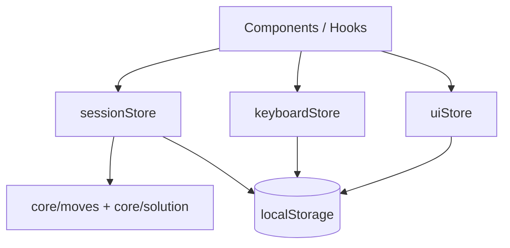

# FMC Paperless 项目架构文档

> 本文档描述代码结构、核心数据类型、字段含义与主要函数职责。产品需求见 [v1.0.0.md](./v1.0.0.md)。

## 1. 项目概览

| 项 | 说明 |
|---|---|
| 名称 | `fmc-paperless` |
| 类型 | 纯前端 SPA（React 19 + TypeScript 6） |
| 构建 | Vite 8 + Tailwind CSS 4 |
| 状态 | Zustand（`persist` 持久化到 `localStorage`） |
| 用途 | 魔方最少步（FMC）无纸化练习：打乱、虚拟键盘、树状解法链、插入、影子、编译消步、计时、导入导出 |

### 1.1 顶层目录

```
fmc-paperless/
├── docs/                    # 需求与架构文档
├── src/
│   ├── main.tsx             # React 入口
│   ├── App.tsx              # 根组件：bootstrap 会话、自动生成打乱
│   ├── types/               # 应用层类型（会话、计时、打乱）
│   ├── core/                # 与 UI 无关的纯逻辑（可单测）
│   │   ├── moves/           # 转动解析、序列化、逆、消步、括号解析
│   │   ├── solution/        # 解法树、插入、影子、编译、导出格式
│   │   └── keyboard/        # 虚拟键盘布局与连续点击
│   ├── store/               # Zustand 全局状态
│   ├── components/          # React UI 组件
│   ├── hooks/               # 组合逻辑 Hook
│   ├── lib/                 # 第三方封装与工具
│   └── __tests__/core/      # 核心单元测试
├── package.json
├── vite.config.ts
└── vitest.config.ts
```

### 1.2 数据流概览



- **会话数据**（打乱、解法链、计时等）集中在 `sessionStore`，持久化键 `fmc.sessions`。
- **键盘布局与位置**在 `keyboardStore`，键 `fmc.keyboard`。
- **抽屉、插入选择器等临时 UI**在 `uiStore`，仅持久化 `drawer` 模式。

---

## 2. 应用层类型（`src/types/index.ts`）

### 2.1 `TimerMode` / `TimerState`

| 字段 | 类型 | 说明 |
|---|---|---|
| `mode` | `'countup' \| 'countdown'` | 正计时 / 倒计时 |
| `initialSeconds` | `number` | 倒计时初始秒数（默认 3600） |
| `startedAt` | `number \| null` | 本次运行开始的时间戳；暂停时为 `null` |
| `elapsedAtPause` | `number` | 已累计秒数（含历史暂停段） |
| `isRunning` | `boolean` | 是否正在计时 |

### 2.2 `ScrambleData`

| 字段 | 类型 | 说明 |
|---|---|---|
| `text` | `string` | 打乱公式文本 |
| `image` | `string \| null` | 打乱图（通常为 data URL / SVG 字符串） |
| `imageHidden` | `boolean` | 是否隐藏打乱图 |

### 2.3 `SolutionChain`

一条「最少步链」，会话可有多条。

| 字段 | 类型 | 说明 |
|---|---|---|
| `id` | `string` | 链唯一 ID（`nanoid`） |
| `name` | `string` | 链名称（用户可编辑） |
| `tree` | `SolutionNode` | 解法树根节点（合成根，不直接编辑步） |
| `insertions` | `Insertion[]` | 本链的插入公式库 |
| `priority` | `Priority` | 链级优先级标记 |
| `color` | `NodeColor` | 链级背景色 |
| `isExpanded` | `boolean` | 链在列表中是否展开 |

### 2.4 `SolveSession`

一把完整练习会话。

| 字段 | 类型 | 说明 |
|---|---|---|
| `id` | `string` | 会话 ID |
| `createdAt` / `updatedAt` | `number` | 创建 / 最后修改时间戳 |
| `scramble` | `ScrambleData` | 当前打乱 |
| `chains` | `SolutionChain[]` | 所有解法链 |
| `activeChainId` | `string` | 当前编辑的链 |
| `activeNodeId` | `string` | 当前焦点节点（接收键盘输入） |
| `arrangementBoard` | `string` | 手动整理板纯文本 |
| `timer` | `TimerState` | 计时器状态 |

### 2.5 `ExportedSession`

导入/导出 JSON 外壳。

| 字段 | 类型 | 说明 |
|---|---|---|
| `version` | `1 \| 2` | 格式版本；`sessionStore` 迁移支持 v1→v2 |
| `exportedAt` | `number` | 导出时间戳 |
| `session` | `SolveSession` | 完整会话快照（导出时计时器强制暂停） |

**v1 → v2 迁移**：旧版把 `tree` + `insertions` 直接放在 `SolveSession` 上；v2 包装为单条 `SolutionChain` 放入 `chains[]`。

---

## 3. 解法核心类型（`src/core/solution/types.ts`）

### 3.1 枚举与别名

| 名称 | 取值 | 说明 |
|---|---|---|
| `Priority` | `none \| low \| medium \| high` | 节点/链优先级 |
| `NodeColor` | `none \| sky \| mint \| lemon \| rose \| lilac` | 节点/链背景色 |
| `InsertionType` | `normal \| wide \| commutator` | 插入替换方式 |

`PLACEHOLDER_CHARS`：默认占位符顺序 `# @ ^ & * ? ~`，用尽后生成 `$1`、`$2`…

### 3.2 `SolutionNode`

树中一个解法步骤节点。

| 字段 | 类型 | 说明 |
|---|---|---|
| `id` | `string` | 节点 ID |
| `moves` | `string` | 原始步公式（可含内联 `( )`、插入占位符） |
| `label` | `string` | 步骤标签（如 EO、DR） |
| `annotation` | `string` | 注释（导出为 `// ...`） |
| `bracketed` | `boolean` | 整段反向标记（无内联括号时，整节点视为一组逆序段） |
| `priority` | `Priority` | 节点优先级 |
| `color` | `NodeColor` | 节点颜色 |
| `children` | `SolutionNode[]` | 子分支（兄弟解法） |
| `isExpanded` | `boolean` | UI 是否展开子树 |

**树语义**：

- 合成 **根节点** 不展示步数；实际步骤从 `root.children` 开始。
- **主路径**：沿每层的 `children[0]` 向下。
- **分支**：同一父节点下多个 `children` 为兄弟解法。

### 3.3 `Insertion`

| 字段 | 类型 | 说明 |
|---|---|---|
| `id` | `string` | 插入项 ID |
| `placeholder` | `string` | 占位符（如 `#`、`@`、`$1`） |
| `moves` | `string` | 替换内容或宽修饰 / 交换子表达式 |
| `type` | `InsertionType` | 见下表 |

| `type` | 替换行为 |
|---|---|
| `normal` | `text.split(ph).join(' ' + moves + ' ')`，前后加空格便于分词 |
| `wide` | 直接拼接，占位符作为 token 内修饰（如 `F#'` + `w` → `Fw'`） |
| `commutator` | 经 `lib/commutator` 展开后再按 normal 方式替换 |

### 3.4 编译相关

**`CompiledNodeInfo`**（单步编译元数据）

| 字段 | 说明 |
|---|---|
| `id` | 节点 ID |
| `moves` / `bracketed` / `label` / `annotation` | 自节点复制 |
| `stepCount` | 本步解析后的步数 |
| `cumulativeCount` | 从根到本步累计步数 |

**`CompiledResult`**

| 字段 | 说明 |
|---|---|
| `text` | 整条分支编译并消步后的最终公式 |
| `moveCount` | 最终步数 |
| `nodes` | 各步 `CompiledNodeInfo` |
| `error` | 首条解析/插入错误（若有） |

**`BranchPath`**

| 字段 | 说明 |
|---|---|
| `ids` | 路径上节点 ID 列表 |
| `nodes` | 路径上 `SolutionNode` 列表 |

---

## 4. 转动核心类型（`src/core/moves/types.ts`）

### 4.1 `Face` / `Modifier` / `Move`

| 类型 | 说明 |
|---|---|
| `Face` | `R L U D F B`（面转）、`x y z`（轴转）、`M E S`（中层） |
| `Modifier` | `none`（顺时针一次）、`prime`（'`）、`double`（`2`） |
| `Move` | `{ face, modifier, wide }`；`wide: true` 表示 `Rw` / 小写 `r` 等宽转 |

常量：

- `FACE_MOVES`、`AXIS_MOVES`、`SLICE_MOVES`
- `OPPOSITE_FACES`：对面映射（用于部分逻辑）
- `isValidFace(s)`：是否为合法面标识
- `parseModifier(suffix)`：从后缀解析 modifier

---

## 5. 键盘类型（`src/core/keyboard/types.ts`）

### 5.1 `KeyDef`

| 字段 | 说明 |
|---|---|
| `id` | 键唯一 ID |
| `label` | 显示文字 |
| `action` | 发送到 `appendKey` 的动作串（如 `R`、`R'`、`#insert`） |
| `type` | `move` \| `modifier` \| `special` |
| `variantGroup` | 长按变体分组（同组共享轮替基准面） |
| `width` | 可选，键宽倍数 |

### 5.2 `KeyboardRow` / `KeyboardLayout`

| 类型 | 主要字段 |
|---|---|
| `KeyboardRow` | `id`, `keys[]`, `isVisible` |
| `KeyboardLayout` | `position`（`bottom \| left \| right \| float`）, `isVisible`, `rows[]` |

### 5.3 连续点击 `CyclingState` / `CyclingResult`

| `CyclingState` 字段 | 说明 |
|---|---|
| `lastAction` | 上一轮插入的 action |
| `clickCount` | 同面连续点击次数 |
| `lastClickTime` | 上次点击时间（超时 500ms 重置） |
| `lastInsertIndex` | 当前 token 在 `moves` 中的起始下标 |

| `CyclingResult.type` | 行为 |
|---|---|
| `append` | 追加新 token |
| `replace` | 从 `fromIndex` 替换为变体 |
| `clear` | 从 `fromIndex` 截断（第四击清空） |

轮替序列：`R → R2 → R' → 空`（`R'` 起始于 `R' → R2 → R → 空`）。

---

## 6. 核心模块函数说明

### 6.1 `core/moves/`

| 模块 | 函数 | 作用 |
|---|---|---|
| `parser.ts` | `parseMoves(input)` | 空格分词，解析为 `Move[]` |
| | `isValidMoveString(input)` | 是否可完整解析 |
| `serializer.ts` | `serializeMove` / `serializeMoves` | `Move` → `R'`、`Rw2` 等字符串 |
| `inverse.ts` | `inverseMove` | 单步取逆（`2` 不变） |
| | `inverseSequence` | 序列逆序并逐步取逆 |
| `bracket-parser.ts` | `hasInlineBrackets` | 是否含 `(` / `)` |
| | `parseMovesWithBrackets` | 拆出 naked 段与 bracketed 组 |
| | `combineSegmentMoves` | 正序 naked + 逆序 bracket 逆，供编译 |
| `simplifier.ts` | `simplify(seq)` | 按轴对 + 宽性分段，模 4 合并 |
| | `countMoves` | 简化后步数 |

**消步规则摘要**：`U/D`、`F/B`、`L/R` 各为轴对；`x/y/z` 各自独立；宽转与非宽转不同段；仅真正合并时重排，否则保留用户顺序。

### 6.2 `core/solution/`

| 模块 | 函数 | 作用 |
|---|---|---|
| `tree-utils.ts` | `createNode` / `createRoot` | 创建节点 / 合成根 |
| | `findNode` / `findParent` / `getPath` | 树查找与路径 |
| | `getMainPath` | 沿 `children[0]` 的主路径 |
| | `getAllLeafPaths` | 所有叶到根路径 |
| | `stepCount` | 节点步数（支持括号串） |
| | `mapTree` / `updateNode` / `toggleExpand` | 不可变树更新 |
| | `ensureExpandedToNode` | 展开到目标节点的祖先 |
| | `addChild` / `addSibling` | 加子节点 / 兄弟节点 |
| | `removeNode` | 删除节点，返回 `nextActiveId` |
| | `cumulativeCountsForPath` | 路径累计步数 Map |
| | `isAncestor` / `leafFromNode` | 祖先判断 / 沿活动分支找叶 |
| `shadow.ts` | `buildShadowMoves` | 仅翻转最后一个 token |
| | `buildShadowNode` | 生成影子兄弟节点 |
| `insertions.ts` | `createInsertion` | 新建插入项 |
| | `nextAvailablePlaceholder` | 分配未占用占位符 |
| | `sanitizePlaceholder` | 规范化用户输入占位符 |
| | `isPlaceholderTaken` | 占位符是否冲突 |
| | `resolveInsertions` | 在编译前替换所有占位符 |
| `compiler.ts` | `compileBranch(nodes, insertions)` | 分支编译为最终公式 |
| `export-format.ts` | `formatMovesExport` 等 | 导出/整理板行格式 |

**编译公式**：

```
final = simplify(
  所有 naked 段（节点顺序）
  ++ 所有 bracket 段的逆（按节点出现顺序，整体逆序拼接）
)
```

每个节点先 `resolveInsertions`，再按 `bracketed` 或内联括号分流。

### 6.3 `core/keyboard/`

| 模块 | 函数 | 作用 |
|---|---|---|
| `cycling.ts` | `resolveCycling` | 连续点击决策 append/replace/clear |
| | `getVariantActions` | 某 action 的轮替变体列表 |
| | `resetCycling` / `isCyclingExpired` | 重置 / 超时判断 |
| `defaults.ts` | `DEFAULT_KEYBOARD_LAYOUT` | 默认 4 行键盘 |
| | `OPTIONAL_ROWS` | 可添加的宽转等模板行 |

---

## 7. Store（`src/store/`）

### 7.1 `sessionStore.ts`

**状态**

| 字段 | 说明 |
|---|---|
| `sessions` | 最多 50 条 `SolveSession` |
| `activeSessionId` | 当前会话 |
| `cycling` | 按 `nodeId` 绑定的键盘轮替状态 |

**选择器**

| 函数 | 说明 |
|---|---|
| `selectActiveSession` | 当前 `SolveSession` |
| `selectActiveChain` | 当前 `SolutionChain` |

**主要 Action 分组**

| 分组 | 方法 | 说明 |
|---|---|---|
| 会话 | `bootstrap`, `newSession`, `switchSession`, `deleteSession` | 初始化；新建/切换/删除；刷新后计时器一律暂停 |
| 打乱 | `setScrambleText`, `setScrambleImage`, `toggleScrambleImageHidden` | 更新打乱 |
| 链 | `newChain`, `deleteChain`, `setActiveChain`, `setChainName`, `setChainPriority`, `setChainColor`, `toggleChainExpand` | 多链管理 |
| 节点 | `setActiveNode`, `setNodeMoves`, `setNodeLabel`, `setNodeAnnotation`, `toggleBracket`, `setNodeColor`, `toggleExpand` | 节点编辑；`toggleBracket` 无内联括号时自动包 `( )` |
| 树结构 | `addChildNode`, `addSiblingNode`, `addShadowNode`, `deleteNode` | 分支与影子 |
| 键盘输入 | `appendKey`, `insertPlaceholder` | 虚拟键盘写入当前活动节点 |
| 插入 | `addInsertion`, `removeInsertion`, `updateInsertion` | 链级插入库；改占位符会全局替换树内文本 |
| 整理板 | `setArrangement` | 手动整理板文本 |
| 计时 | `startTimer`, `pauseTimer`, `resetTimer`, `setTimerMode`, `setTimerInitial` | 基于时间戳的累计 |
| 导入 | `importSession` | 解析 JSON、迁移、生成新 ID 并设为活动 |

`appendKey` 特殊动作：`backspace`、`(`、`)`、`#insert`、`2`/`'`/`w`（修饰最后一个 token）、普通转动（走 cycling）。

### 7.2 `keyboardStore.ts`

| 方法 | 说明 |
|---|---|
| `setPosition` | `bottom \| left \| right \| float \| hidden` |
| `showForInput` / `hideForInput` | 聚焦输入时恢复/隐藏键盘 |
| `setRows`, `addOptionalRow`, `removeRow`, `moveRow` | 最多 6 行布局配置 |
| `reset` | 恢复默认布局 |

### 7.3 `uiStore.ts`

| 字段 / 方法 | 说明 |
|---|---|
| `drawer` | `none \| arrangement \| sessions` 侧抽屉模式 |
| `configuringKeyboard` | 是否处于键盘配置 UI |
| `insertionPicker` | 多插入时选择占位符的目标 `{ nodeId, chainId }` |

---

## 8. Hooks（`src/hooks/`）

| Hook | 作用 |
|---|---|
| `useScramble` | `generate()` 调用 cstimer 生成 `333fm` 打乱与图；`refreshImage(text)` 仅刷新图 |
| `useTimer` | 每秒 tick，返回 `deriveTimerDisplay`（正/倒计时、15/5 分钟告警） |
| `useKeyboardInput` | 绑定物理键盘到 `appendKey`（见组件使用） |
| `useMoveInputKeyboard` | 点击非输入区时 `hideForInput` |
| `useLongPress` | 长按检测，供 `LongPressPopup` |
| `useMoveInputKeyboardDismiss` | AppShell 内注册 dismiss |

---

## 9. 库与工具（`src/lib/`）

| 文件 | 说明 |
|---|---|
| `cstimer-worker.ts` | 在 Web Worker 中加载 `cstimer_module`；`getScramble(type)`、`getImage(scramble, type)` |
| `persistence.ts` | `serializeForExport`、`parseImport`、`downloadJson`、`timestampFilename` |
| `commutator.ts` | vendored 交换子库；对外 `expand({ algorithm })` |
| `svg-to-png.ts` | 打乱图格式转换（若 UI 需要） |
| `cn.ts` | `clsx` 风格 className 合并 |

---

## 10. UI 组件结构（`src/components/`）

| 目录 | 组件 | 职责 |
|---|---|---|
| `layout/` | `AppShell`, `Header`, `SideDrawer` | 整体布局、顶栏、侧抽屉容器 |
| `scramble/` | `ScrambleBar` | 打乱条、生成/编辑、图显隐 |
| `timer/` | `Timer` | 计时显示与控制 |
| `sessions/` | `SessionsMenu` | 会话列表切换 |
| `solution-chain/` | `ChainList`, `ChainView`, `TreeNode`, `ChainHeader`, `ChainInsertions`, `BranchFooter`, `NodeActions`, `AnnotationEditor`, `InsertionPicker` | 多链列表、树渲染、插入管理、分支编译预览 |
| `virtual-keyboard/` | `VirtualKeyboard`, `KeyboardKey`, `LongPressPopup`, `KeyboardConfigurator` | 虚拟键盘与配置 |
| `arrangement-board/` | `ArrangementBoard` | 手动整理板 |
| `import-export/` | `ImportExport` | JSON 导入导出 |
| `common/` | `Icons` | SVG 图标 |

**`App.tsx`**：`bootstrap()` → 无打乱时自动 `generate()` 写入会话。

---

## 11. 持久化键一览

| localStorage 键 | 内容 |
|---|---|
| `fmc.sessions` | `sessions[]`, `activeSessionId`（version 2，含 v1 迁移） |
| `fmc.keyboard` | `layout`, `position`, `lastLayoutPosition` |
| `fmc.ui` | `drawer` |

---

## 12. 测试

| 路径 | 覆盖 |
|---|---|
| `src/__tests__/core/moves.test.ts` | 解析、消步、逆 |
| `src/__tests__/core/solution.test.ts` | 树操作、编译、插入、影子 |
| `src/__tests__/core/keyboard.test.ts` | 连续点击轮替 |

运行：`npm run test`

---

## 13. 扩展建议

数据结构已预留扩展点：

- `SolveSession` / `ExportedSession.version` 可递增新字段
- `InsertionType` 可增加新替换策略
- `SolutionChain` 支持同会话多链对比
- `Priority` / `NodeColor` 可扩展枚举

新增功能时优先放在 `core/` 并保持 `sessionStore` 为唯一写入口，便于测试与导入导出兼容。

---

## 14. 相关文档

- [v1.0.0.md](./v1.0.0.md) — 产品需求与交互细则
- [README.md](../README.md) — 快速上手与脚本说明
